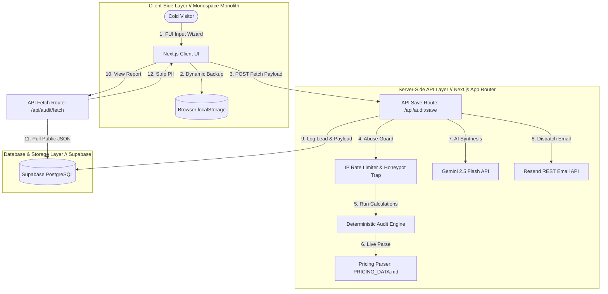

# CredAI — System Architecture Specifications

This document outlines the system architecture, real-time data flows, stack justifications, and scalability roadmaps for the CredAI Spend Audit platform.

---

## 🗺️ System Diagram

The following interactive Mermaid diagram illustrates the unified Next.js App Router client-server boundaries, downstream API hooks, and database logging endpoints:

---

## 🔄 Data Flow: From User Input to Audit Result

The lifecycle of a single audit session is executed through six distinct chronological phases:

1.  **Form Capture & Browser Hydration:** 
    *   The visitor enters team scale and active AI subscription details on the React multi-step wizard.
    *   All inputs, plan states, and partial inputs are instantly backed up to browser `localStorage` inside the client view-model to prevent data loss on page refreshes.
2.  **Request Gatekeeping & Abuse Checks:**
    *   When the user submits the lead form, the client issues a POST request containing the workspace payload, optional company/role details, and the hidden `website` honeypot value.
    *   The server API save route (`/api/audit/save`) validates the honeypot: if populated, it immediately returns a fake success JSON block to deflect the spam bot.
    *   If valid, the server isolates the client's IP and executes a sliding-window rate limit validation. If the client has made more than 5 requests in 10 minutes, the server immediately rejects the transaction with a `429 Too Many Requests` status.
3.  **Deterministic Optimization Calculations:**
    *   The engine parses the local `PRICING_DATA.md` at runtime using our file-system reader. 
    *   It executes our deterministic audit rules: checking seat-plan fit, Same-Vendor Downgrades, Cross-Tool Redundancy assessments (Cursor/Copilot, ChatGPT/Claude), and flagging direct API spending models over $300/mo for bulk Credex credit conversions.
    *   *Pricing Discrepancy & Dynamic Confidence Rating (Attention to Detail):* If a user inputs a customized monthly spend that deviates from standard catalog rates (such as entering $17 for ChatGPT Plus instead of its official $20/mo list price), the calculations engine programmatically intercepts the transaction. It automatically lowers its calculation confidence score to **`80%`** (`0.80`) and appends a smart advisory notice warning the tech lead that negotiated, annual, or bundled enterprise discounts are active—ensuring the audit remains highly realistic and context-aware under custom business agreements.
4.  **Personalized Summary Synthesis:**
    *   The server contacts the Gemini 2.5 Flash API via direct REST fetch. 
    *   It passes a strict, professional prompt to generate a high-density, ~100-word quantitative report summarizing exactly what is leaking, the proposed resolution, and the business savings value. 
    *   *Uptime Fallback:* If the Gemini API key is missing or calls time out, the server instantly triggers a mathematical template compiler to formulate a local summary, guaranteeing 100% service availability.
5.  **PII-Stripped Secure Database Logging:**
    *   The server saves the calculations payload to the `audits` table, returning a unique UUID `slug`.
    *   If a marketing email is supplied, the client's email, company, and job role are saved separately to the `leads` table, referenced back to the audit UUID.
    *   *Security Isolation:* RLS policies restrict read permissions on the `leads` table strictly to authenticated administrative sessions, preventing public leakages.
6.  **Transactional Outreach Delivery:**
    *   The save route sends a high-density, monospace HTML confirmation email via the Resend API to the lead's email.
    *   If monthly savings exceed $100, the template appends a **High-Savings Priority Flag**, informing the startup that a Credex consultant will reach out with custom bulk credits.
    *   The client redirects to the public shareable report `/audit/[slug]`, which queries `/api/audit/fetch` to load the PII-stripped calculations payload securely.

---

## ⚡ Stack Justification

*   **Next.js 15 (App Router):** Decouples client presentation from backend logic. Using unified Next.js API routes allowed us to implement rate-limiters, honeypots, database integrations, and transactional email dispatches inside a singular server runtime without provisioning a separate Node.js service.
*   **Supabase (PostgreSQL):** Instantly provisions a high-reliability relational database complete with advanced constraints and indexing (`created_at` DESC indexes). PostgreSQL's robust RLS (Row Level Security) allowed us to make audit reports public while keeping marketing emails strictly private.
*   **Tailwind CSS (Monospace Monolith):** Fully customized design system featuring high-contrast Volt Lime accents, industrial 1px grid divider lines, absolute Tech viewfinder corners, and a strict monospace font stack. This premium, clean visual identity immediately differentiates CredAI from generic modern SaaS applications.
*   **Direct REST API Calls (Gemini & Resend):** We bypassed official Node.js SDK libraries and contacted third-party APIs using native HTTP `fetch`. This eliminated Webpack bundling conflicts where Node-specific built-ins crashed client hydration and kept serverless dynamic routes lightweight and compile-safe.

---

## 📈 Scalability Blueprint: Supporting 10,000+ Audits/Day

If the application is subjected to high traffic scaling to 10,000+ audits per day (approximately 7 concurrent requests per minute, with highly spikey distributions), we would implement the following architectural enhancements:

### 1. Globally Replicated Redis Rate Limiting (Vercel KV / Upstash)
*   **The Problem:** Currently, our IP-based rate limiter operates in-memory on the active server instance. Under massive scaling, serverless deployment platforms (like Vercel or AWS Amplify) dynamically spin up multiple isolated computing instances, resetting our in-memory `Map` counters per instance.
*   **The Change:** We would migrate our sliding-window rate limiter to use a globally-replicated Redis cache instance. Every save route execution will trigger a fast Redis atomic increment to verify IP request frequencies globally.

### 2. Message Queuing for Asynchronous Tasks (AWS SQS / Vercel KV)
*   **The Problem:** In the current architecture, both the Gemini API generation call and the Resend API email dispatch run synchronously during the POST request execution. If either third-party API encounters network latency, the client's save execution is delayed, leading to potential HTTP timeouts.
*   **The Change:** We would decouple saving from synthesis. The save API route will write to the database and immediately return the shared `slug` to the user (taking < 50ms). It will simultaneously dispatch a message payload to an asynchronous background worker queue (e.g. AWS SQS or Vercel Background Jobs) to handle LLM personalized text synthesis and Resend email deliveries asynchronously, separating failures and maximizing throughput.

### 3. Connection Pooling (PgBouncer)
*   **The Problem:** 10,000 concurrent database writes per day can exhaust PostgreSQL's default process socket connections, leading to fatal `Too many clients` exceptions from Supabase.
*   **The Change:** We would enable connection pooling in Supabase using PgBouncer to buffer and recycle PostgreSQL database connections efficiently, supporting thousands of concurrent active inserts safely.

### 4. Memory-Cached Static JSON Catalog Module
*   **The Problem:** Reading `PRICING_DATA.md` from the filesystem at runtime introduces I/O overhead under heavy concurrent request distributions.
*   **The Change:** We would compile our pricing parser to output a static `pricing.json` module at build-time or load it into a global Node memory-cache (with Edge CDN replication) to bypass local file I/O operations entirely.
