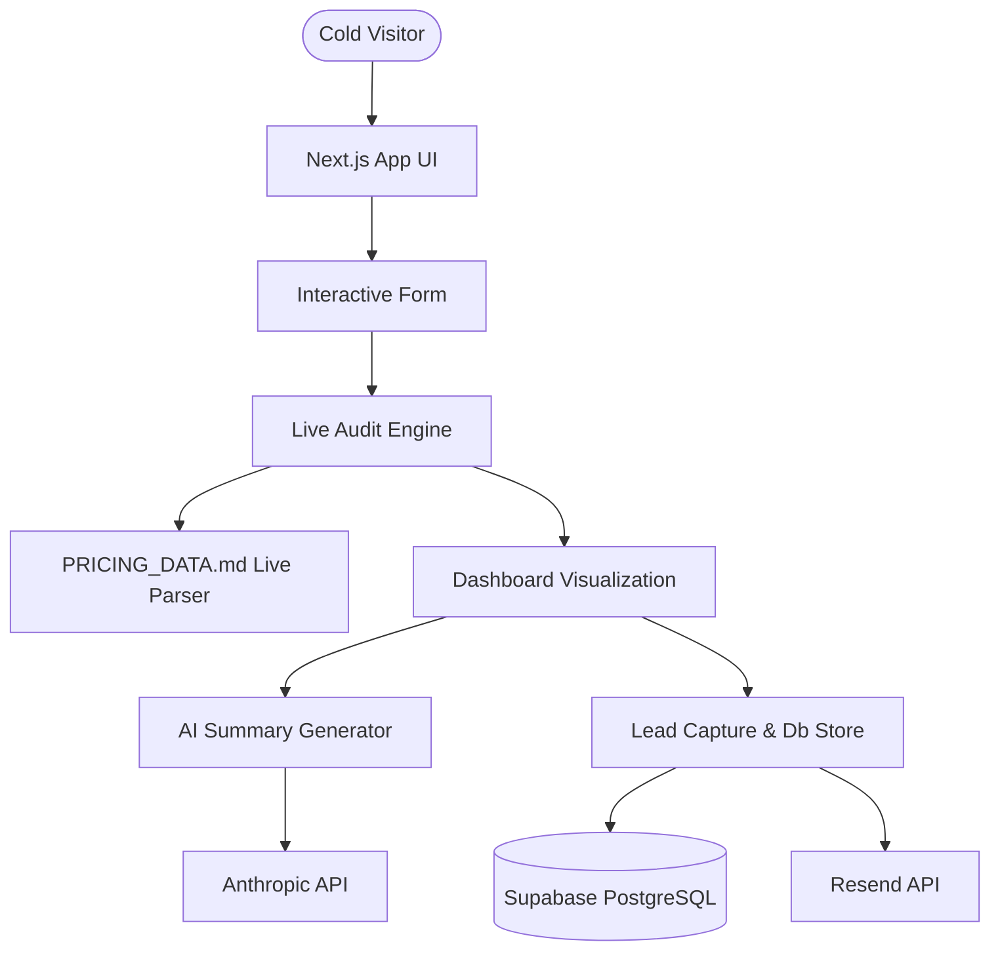

# ARCHITECTURE.md

## System Diagram

## Data Flow
1. **Visitor landing & Inputting:** Form states are captured in client-side state and backed up dynamically in `localStorage`.
2. **Deterministic Audit Execution:** Calculations are processed using our live parser, which reads `PRICING_DATA.md` at runtime on the server to prevent any price hardcoding.
3. **Report Storage:** Once the email is captured, the report payload is stored in Supabase PostgreSQL, creating a unique shareable UUID.

## Stack Justification
- **Next.js 15 (App Router):** Unified frontend/backend architecture, server actions, dynamic server rendering for social OG generation, and seamless local caching.
- **Supabase:** Instant Postgres instance with a modern schema, fast querying, and zero DevOps overhead during the 7-day build sprint.
- **Tailwind CSS + shadcn/ui:** Rich design tokens, dark mode integration, smooth transitions, and premium components.
