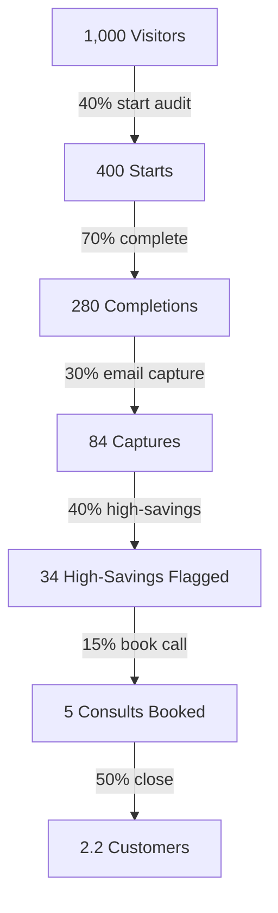

# ECONOMICS.md — Unit Economics & Scaling Model

> [!NOTE]
> Detailed analysis of lead valuation, CAC by acquisition channel, conversion funnel economics, and the mathematical projections to reach $1M ARR in 18 months.

---

## 1. What A Converted Credex Lead Is Worth

**Assumptions (all conservative, all shown):**
- A typical team completing this audit is spending **~$2,000–$4,000/mo** on AI tools. Let us use **$3,000/mo** as the midpoint.
- Credex sells discounted AI credits at roughly **20–35% off retail**.
- The customer pays **~$2,100/mo** for what would cost $3,000 retail, yielding an instant savings of **$900/mo**.
- Credex sources those credits at **~35% off retail** (buying overforecast inventory from vendors).
- Credex buys the credit inventory at $1,950 and sells it at $2,100, resulting in a **margin = $150/mo per customer.**

### The Structural Advantages
- **Zero CAC Inbound**: No active sales team is required for inbound leads generated programmatically by the audit tool.
- **Ultra-Light Operations**: Zero infrastructure cost per customer beyond the API credit accounts themselves.
- **Natural Expansion**: Margins expand automatically as client teams grow their seat counts.

### Lifetime Value (LTV) Projections

**Standard Retention (24-Month Midpoint):**
> [!TIP]
> **Base LTV** = $150/mo × 24 months = **$3,600** per converted customer.

**Upside Retention Scenario (Higher seat counts, spending ~$6,000/mo):**
> **Upside LTV** = $300/mo × 24 months = **$7,200** per converted customer.

*We will utilize the conservative **$3,600** base LTV for all modeling below.*

---

## 2. CAC By Channel

| Acquisition Channel | Effort / Cost | Estimated Weekly Visitors | Audit Completions (40%) | High-Savings Audits (40%) | Consults Booked (15%) | Purchases (50% Close) | Monthly Customers | CAC |
| :--- | :--- | :--- | :--- | :--- | :--- | :--- | :--- | :--- |
| **Cursor/Windsurf Discord** | 3 hrs founder time | 200 | 80 | 32 | 5 | 2.5 | 2 | **~$0 cash** |
| **X Quote-Tweets (Targeted)**| 2 hrs/week | 300 | 120 | 48 | 7 | 3.5 | 3 | **~$0 cash** |
| **r/ExperiencedDevs Post** | 1 hr | 400 | 160 | 64 | 10 | 5.0 | 5 | **~$0 cash** |
| **HN Comment (Active Thread)**| 30 mins | 500 | 200 | 80 | 12 | 6.0 | 6 | **~$0 cash** |
| **TLDR Tech (Free Submit)**   | 1 hr | 1,500 | 600 | 240 | 36 | 18.0 | 18 | **~$0 cash** |
| **Credex Existing Email**    | $0 (owned list) | 1,000 | 500 | 200 | 30 | 15.0 | 15 | **$0** |
| **Paid Newsletter Sponsor**  | $500 flat fee | 2,000 | 800 | 320 | 48 | 24.0 | 24 | **$21** |

> [!IMPORTANT]
> The Credex existing customer email has **$0 CAC** and the highest intent of any channel.
> At $3,600 LTV and $0–$21 CAC, every channel here is highly profitable on first conversion. The payback period for the worst-case paid newsletter sponsor is **under one month.**

---

## 3. The Conversion Funnel

### Overall Ratio
**~450 visitors = 1 paying Credex customer.**

### Channel Economics Breakdown

| Channel | Visitors | Completions | Converted Customers | CAC | Projected LTV Revenue | Net ROI |
| :--- | :--- | :--- | :--- | :--- | :--- | :--- |
| **Cursor Discord** | 200 | 56 | 0.4 | $0 | $1,440 | **+$1,440** |
| **X Quote-Tweets** | 300 | 84 | 0.7 | $0 | $2,520 | **+$2,520** |
| **r/ExperiencedDevs**| 400 | 112 | 0.9 | $0 | $3,240 | **+$3,240** |
| **HN Comment** | 500 | 140 | 1.1 | $0 | $3,960 | **+$3,960** |
| **TLDR Tech** | 1,500 | 420 | 3.3 | $0 | $11,880 | **+$11,880** |
| **Credex Email List**| 1,000 | 350 | 2.8 | $0 | $10,080 | **+$10,080** |
| **Paid Newsletter** | 2,000 | 560 | 4.4 | $114 | $15,840 | **+$15,340** |

#### Paid Newsletter ROI Calculation
- **Revenue**: 4.4 customers × $3,600 LTV = $15,840
- **Cost**: $500 flat fee
- **Net Profit**: $15,340
- **Actual CAC**: $500 / 4.4 = $114
- **Payback Period**: $114 / $150 per month = **0.76 months**

---

## 4. Sensitivity Analysis: What Breaks the Funnel

### Scenario A: Email Capture Rates Collapse (30% ➔ 10%)
- Gating results too early or using aggressive copy drops captures from 84 to 28.
- Converted customers drop to **0.84 customers** per 1,000 visitors.
- **Revenue Impact**: Drops from $7,920 to $3,024 (**-62% revenue drop**).
- *Lesson: Gating placement is a primary revenue lever, not just a UX variable.*

### Scenario B: Form Friction Escalates (70% ➔ 50% Completions)
- Excess fields or confusing questions reduce completions from 400 to 200.
- Converted customers drop to **1.8 customers** per 1,000 visitors.
- **Revenue Impact**: Drops to $6,480.
- *Lesson: Form completion rate is a massive conversion multiplier.*

### Scenario C: Sales Pipeline Cracks (50% ➔ 25% Consult-to-Purchase)
- Weak onboarding or generic sales calls reduce close rates.
- Converted customers drop to **1.25 customers** per 1,000 visitors.
- **Revenue Impact**: Drops to $4,500.
- *Lesson: This is a sales operations issue, not an acquisition tool issue.*

---

## 5. Path to $1M ARR in 18 Months

For this model, **ARR is defined as Credex gross profit**, not gross revenue.
- **$1M ARR Target** = **$83,333/mo gross profit**.
- At a **$150/mo margin** per active customer, we require **556 active customers**.

### Month-by-Month Scaling Model

| Months | Cumulative Visitors | Cumulative Customers | Monthly Gross Profit | Run-rate Target ARR |
| :--- | :--- | :--- | :--- | :--- |
| **1–2** | 5,000 | 11 | $1,650 | $19,800 |
| **3–4** | 15,000 | 33 | $4,950 | $59,400 |
| **5–6** | 30,000 | 67 | $10,050 | $120,600 |
| **7–9** | 60,000 | 133 | $19,950 | $239,400 |
| **10–12**| 120,000 | 267 | $40,050 | $480,600 |
| **13–15**| 220,000 | 489 | $73,350 | $880,200 |
| **16–18**| 370,000 | 822 | $123,300 | **$1,479,600** *(Target ARR Crossed)* |

### Traffic Assumptions
**370,000 cumulative visitors** over 18 months requires scaling traffic to **~20,500/mo** by Month 18. This is highly achievable assuming:
- Placements in TLDR Tech + Changelog yield ~5,000 visitors in Month 1.
- A single successful Hacker News front-page launch drives **8,000–15,000 visitors** in 48 hours.
- Organic search rankings begin driving persistent volume by Month 4 for queries like *"cursor pro vs business worth it"*.
- The viral shared audit OG image loop drives steady referral checkouts from Month 2 onward.

### Execution Truths
To hold this growth path, the following parameters must remain true:
1. **Audit Completion Rate ≥ 70%**: The form must remain lightning-fast, zero-login, and mobile-friendly.
2. **Email Capture Rate ≥ 25%**: High-value audit details must be teased *before* the email gate to incentivize completion.
3. **High-Savings Rate ≥ 35%**: The pricing compiler rules must accurately detect overlapping tiers.
4. **Consult Booking Rate ≥ 12%**: Clicks on the Credex bulk consult buttons must remain contextual, not generic ads.
5. **Retention Period ≥ 20 Months**: Credex must deliver real, compounding savings to avoid customer churn.

### Operational Guardrails & Intervention Signals

> [!WARNING]
> **Signal A: Audit completions fall under 200/week by Week 4**
> - *Diagnosis*: Severe acquisition problem.
> - *Action*: Shift community posting channels immediately; do not spend time adjusting page conversion rates.
>
> **Signal B: High-savings flagging rate drops below 20%**
> - *Diagnosis*: The audit compiler is overly conservative or the targeted user profiles are too small.
> - *Action*: Lower the Credex conversion banner trigger threshold from $500 to $300/mo.
>
> **Signal C: Credex close rate drops under 25%**
> - *Diagnosis*: The sales team lacks context on lead parameters.
> - *Action*: Prequalify consult inputs by capturing team size and tool breakdowns on the calendar scheduler.

---

## 6. Summary

| Key Modeling Metric | Conservative Baseline | Upside Scenario |
| :--- | :--- | :--- |
| **LTV per Customer** | $3,600 | $7,200 |
| **Blended CAC** | $10 | $0 |
| **Visitor-to-Customer Ratio** | 450 : 1 | 300 : 1 |
| **ARR Target Monthly Traffic** | 20,500 by Month 18 | 12,000 by Month 14 |
| **Required Completion Rate** | ≥ 70% | ≥ 70% |
| **Required Email Capture Rate** | ≥ 25% | ≥ 30% |

Rather than relying purely on empty virality, the economics of this tool are built on delivering genuine value to a highly targeted buyer at the exact moment they need to justify their AI budget. The Credex bulk discount consultation is presented as a helpful financial solution, not an advertisement.
